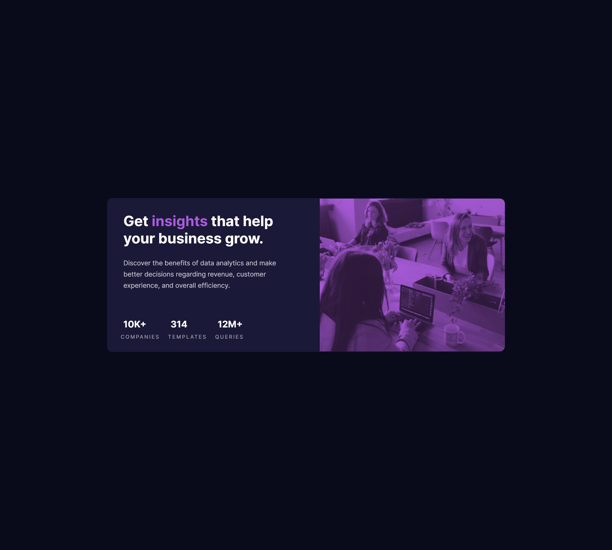

## Table of contents

- [Overview](#overview)
  - [Screenshot](#screenshot)
  - [Links](#links)
- [My process](#my-process)
  - [Built with](#built-with)
  - [What I learned](#what-i-learned)
  - [Continued development](#continued-development)
- [Author](#author)

## Overview

Your challenge is to build out this card component and get it looking as close to the design as possible.

You can use any tools you like to help you complete the challenge. So if you've got something you'd like to practice, feel free to give it a go.

Your users should be able to:

- View the optimal layout depending on their device's screen size

### Screenshot

### Links

- Solution URL: [Solution](https://www.frontendmentor.io/solutions/results-summary-component-6zpPHXUzZa)
- Live Site URL: [Live](https://genuinemiyashita.github.io/Stats-Preview-Card/)

## My process

Started with the mobile approach and worked my way up to larger breakpoints. Tried taking into account both landscape and portrait mode for breakpoints around an ipad Mini/Air.

### What I learned

Getting more practice with overlays, such as, the purple overlay for the image. I struggle with it since this and the NFT challenge were the first challenges that required it, but this time the method was a little different and required me to take some time research the best approach.

### Continued development

I keep saying I want to use Bootstrap/Bulma/CSS Framework. However, I feel as if all these preview cards aren't really worth it. I might just jump up to a larger challenge as I've been sorting from easiest to hardest and working my way up.

## Author

- Frontend Mentor - [@GenuineMiyashita](https://www.frontendmentor.io/profile/GenuineMiyashita)
